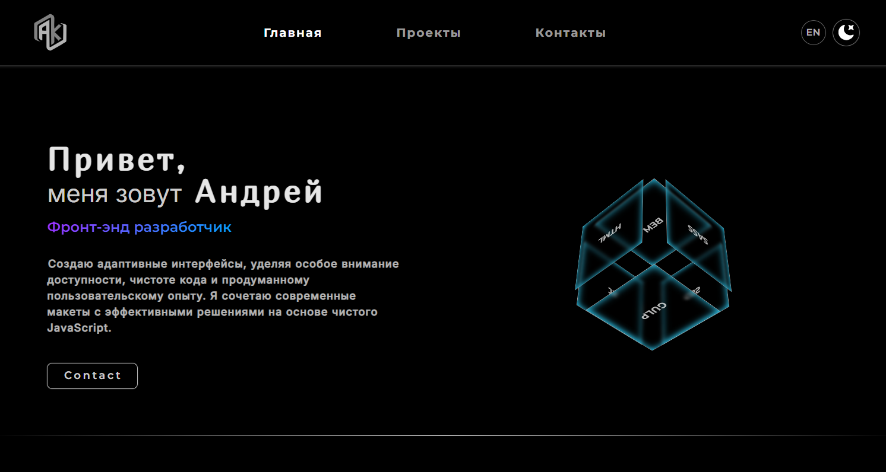
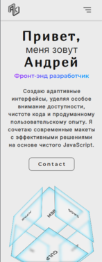
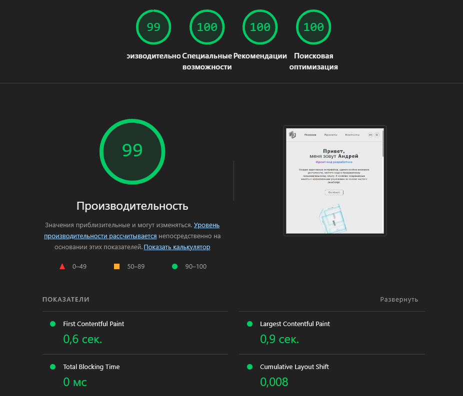
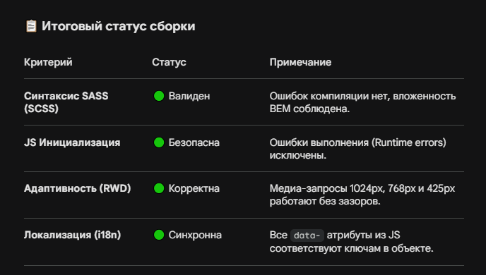

# Мое Профессиональное Портфолио

Современное, адаптивное и интерактивное веб-портфолио frontend-разработчика, созданное с использованием модульной архитектуры и лучших практик веб-разработки.

## 🚀 Ссылка на проект

- [Живой сайт (Демо)](https://qooler-667.github.io/Portfolio/)

## 🛠️ Технологический стек

- **Layout & Styles:** HTML5 (семантическая верстка), SCSS/CSS3 (динамические стили, CSS Grid, Flexbox).
- **Methodology:** BEM (БЭМ) для чистоты и масштабируемости классов.
- **JavaScript:** Vanilla JS (ES6+), асинхронные запросы (`fetch`), модульная структура.
- **Task Runner:** Gulp (автоматизация сборки, минификация, оптимизация ресурсов).
- **Version Control:** Git & GitHub (разработка велась по Feature Branch Workflow).

## 📱 Превью проекта & Технические метрики (UI & Performance)

  <table style="border: none; border-collapse: collapse; background: none; width: 100%;">
    <tr>
      <td align="center" valign="top" colspan="2" style="border: none; padding: 10px;">
        <strong>Dark Mode (Desktop Interface)</strong>  
        
      </td>
    </tr>
    <tr>
      <td align="center" valign="middle" style="border: none; padding: 20px 10px; width: 35%;">
        <strong>Mobile Version (Light)</strong>  
        
      </td>
      <td align="center" valign="middle" style="border: none; padding: 20px 10px; width: 65%;">
        <strong>Google Lighthouse Audit (Clean Environment)</strong>  
        
      </td>
    </tr>
    <tr>
      <td align="center" valign="top" colspan="2" style="border: none; padding: 20px 10px;">
        <strong>📋 Итоговый статус сборки и валидация</strong>  
        
      </td>
    </tr>
  </table>

## 💡 Ключевой функционал

- 🌍 **Мультиязычность (RU / EN):** Полноценная локализация интерфейса через дата-атрибуты (`data-i18n`) со словарем данных и автоматическим сохранением выбора пользователя в `localStorage`.
- 🌓 **Динамическая тема:** Переключение между светлой и темной темами на основе CSS-переменных с сохранением состояния при перезагрузке страницы.
- 📱 **Адаптивный интерфейс:** Полная отзывчивость (Mobile First / Desktop First) со встроенным кастомным бургер-меню (изолированный модуль, блокировка скролла при открытии).
- 🎛️ **Интерактивный слайдер:** Карусель проектов с настроенными брейкпоинтами для различных разрешений экрана.
- 📬 **Форма обратной связи:** Интеграция с сервисом Formspree. Работает асинхронно (AJAX/Fetch) без перезагрузки страницы, с визуальной валидацией, обработкой ошибок и динамическим изменением состояний кнопки («Отправка...» / «Успешно отправлено!»).

## 📁 Структура проекта (JavaScript)

Логика скриптов полностью декомпозирована на независимые модули в папке `src/js/`:

- `main.js` — точка входа и инициализация модулей.
- `_burger.js` — управление мобильным меню.
- `_theme.js` — логика переключения тем оформления.
- `_slider.js` — инициализация и кастомизация слайдера.
- `_form.js` — асинхронный обработчик формы Formspree.
- `_translate.js` & `translations.js` — система локализации и словарь.
- `_active.js` — глобальные интерактивные состояния элементов.
